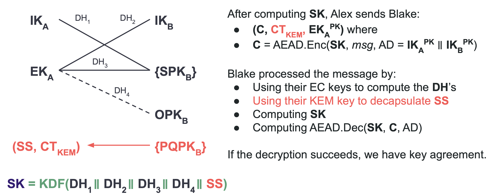
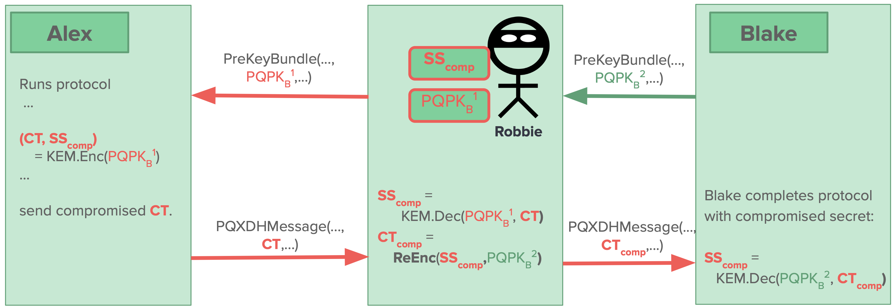
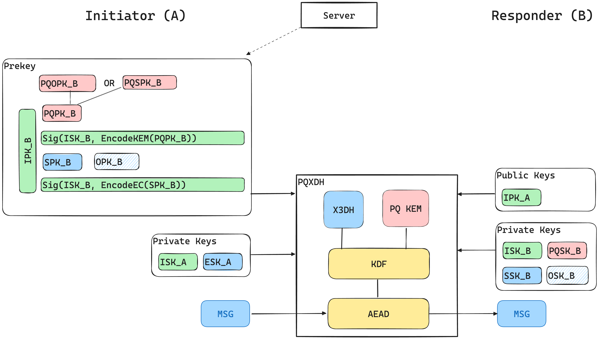

# Key Generation

[Ablauf PlantUML](../assets/pqxdh.puml)

## Quantum Resistance and the Signal Protocol
`@kretQuantumResistanceSignal`

- erster Schritt in Richtung Quantum-Resistenz
    - Upgrade von [X3DH](https://signal.org/docs/specifications/x3dh/) zu PQXDH
- zusätzliche Schicht
- Entgegenwirken von _Harvest Now, Decrypt Later_ Attacken
- [Whitepaper](#the-pqxdh-key-agreement-protocol)

 

- neue _One-Way Functions_, welche nicht einfach von QC invertierbar sind
    - [NIST Standardization Process for Post-Quantum Cryptography](https://csrc.nist.gov/projects/post-quantum-cryptography)
    - Kandidaten teilweise angreifbar durch klassische Computer $\to$ Vorsicht bei Integration
- Entscheidung für [**CRYSTALS-Kyber**](https://pq-crystals.org/kyber/) _Key-Encapsulation Mechanismus_
- Erweiterung von Elliptic-Curve (X25519) $\to$ beide Systeme müssen geknackt werden
- Kombination der _Shared Secrets_ beider Algorithmen

## The PQXDH Key Agreement Protocol
`@kretPQXDHKeyAgreement2024`

- PQXDH etabliert _Shared Secret_ zwischen zwei Partien, welche sich gegenseitig durch Public Keys authentifizieren
- Quantum-sichere _Forward Secrecy_, kryptografische _Deniability_
- immer noch basierend auf Schwierigkeit des Diskreten-Logarithmen-Problems für gegenseitige Authentifizierung
- asynchron, Offline-Verfügbarkeit

### Parameter

| Parameter | Definition |
|-----------|------------|
| `curve` | Art der Elliptic Curve, bspw. `curve25519` |
| `hash` | Hash-Funktion, bspw. `SHA-512` |
| `info` | ASCII-String zur Identifikation der Anwendung, bspw. `MyProtocol` |
| `pqkem` | Post-Quantum Key Encapsulation Mechanism, bspw. `CRYSTALS-Kyber-1024` |
| `aead` | Schema für _Authenticated Encryption with Associated Data_ |
| `EncodeEC` | Funktion, die `curve`-Public-Key in Byte-Sequenz verschlüsselt |
| `DecodeEC` | Funktion, die Byte-Sequenz in `curve`-Public-Key entschlüsselt, Inverses von `EncodeEC` |
| `EncodeKEM` | Funktion, die `pqkem`-PK in Byte-Sequenz verschlüsselt |
| `DecodeKEM` | Funktion, die Byte-Sequenz in `pqkem`-PK entschlüsselt, Inverses von `EncodeKEM` |

### Rollen

- Parteien: Alice, Bob und Server
- Alice
    - Senden von initialen, verschlüsselten Daten an Bob
    - Etablierung eines Shared Key $\to$ Verwendung für bidirektionale Kommunikation
- Bob
    - möchte es Parteien wie Alice erlauben, dass SK etabliert und verschlüsselte Daten gesendet werden
    - ggf. offline, wenn Alice dies versucht $\to$ Beziehung zu einem Server
- Server
    - Speicherung von Nachrichten von Alice an Bob
        - späterer Abruf durch Bob
    - Veröffentlichung von Daten von Bob, welche Alice zur Verfügung gestellt werden
    - ggf. Aufteilung in mehrere Komponenten

### Notation

- Verkettung von Byte-Sequenzen $X, Y$ ist $X || Y$
    - hier: $X \circ Y$
- $DH(PK_1,PK_2)$: Shared Secret, Output von Diffie-Hellman-Funktion (je nach `curve`-Parameter)
- $Sig(PK,M,Z)$: `curve` XEdDSA-Signatur der Byte-Sequenz $M$, welche mit $PK$'s Private Key erstellt wurde unter Verwendung von 64B von $Z$-_Randomness_
- $KDF(KM)$: 32B Output vom HKDF-Algorithmus (_Key Derivation Function_)
    - verschiedene Parameter von HKDF erklärt
- $(CT,SS) = \text{PQKEM-ENC}(PK)$: KEM-Ciphertext aus `pqkem`-Algorithmus und Shared Secret, welche im CT durch Public Key eingebettet ist
- $\text{PQKEM-DEC}(PK,CT)$: dekodiertes Shared Secret $SS$
    - Verwendung vom Private Key $PK$, welcher zum Public Key passt, mit welchem $CT$ verschlüsselt wurde

#### Elliptic Curve Keys

- $IK_A$, $IK_B$: Identity Key von Alice / Bob
    - Long-Term Identity Elliptic Curve Public Key
- $EK_A$: _Ephemeral Key_ (public) von Alice
    - neue Generierung für jeden _Protocol Run_
- $SPK_B$: _Signed Prekey_ von Bob
    - regelmäßiger Wechsel
    - Signieren mit $IK_B$
    - Veröffentlichung auf Server zusammen mit Identifier $IdEC$
- $(OPK_B^1, OPK_B^2, \ldots)$: Menge an _One-Time Prekeys_ von Bob
    - Verwendung in jeder einzelnen PQXDH-Protokoll-Runde
- $IdEC(K)$: eindeutiger Identifier für Keys ($SPK$ oder $OPK$)
    - Speicherung auf Bobs Gerät

#### Post-Quantum Key Encapsulation Keys

- $(PQOPK_B^1, PQOPK_B^2, \ldots)$: Bobs Menge an signierten One-Time `pqkem` Pre-Keys
    - signiert mit $IK_B$
    - Verwendung in jeder Protokoll-Runde
- $PQSPK_B$: Bobs signierter _last-resort_ `pqkem` Pre-Key
    - periodische Änderung
    - signiert mit $IK_B$
    - wird nur verwendet, wenn $PQOPK_B$ nicht verfügbar
        - bspw. wenn mehr Keys als hochgeladen abgefragt werden
- $IdKEM(K)$: Identifier für jeden $PQSPK$ bzw. Ephemeral KEM-Key
    - zur eindeutigen Identifikation des jeweiligen Keys auf Bobs Gerät
- Speicherung der Keys + Identifier auf Server

### PQXDH-Protokoll

**3 Phasen**
- Bob veröffentlicht EC Identity-Key, EC Prekeys & `pqkem`-Prekeys auf Server
- Alice ruft _Prekey Bundle_ vom Server ab; verwendet diese für initiale Nachricht an Bob
- Bob empfängt und verarbeitet initiale Nachricht von Alice

#### I. Veröffentlichung der Keys

- Bob generiert 64 Byte zufällige Werte $Z_{\text{SPK}}, Z_{\text{PQSPK}}, Z_1, Z_2, \ldots$
- Veröffentlichung von verschiedenen Keys
    - siehe Paper
- Identity Key $IK_B$ wird nur einmal hochgeladen
- neue One-Time Prekeys jederzeit möglich
    - bspw. wenn Bob vom Server informiert wird, dass nur noch wenige vorliegen
- neuer signierter `curve`-Prekey bzw. signierter Last-Resort-`pqkem`-Prekey in bestimmten Intervall
    - wieder mit $IK_B$ signiert
    - neue Prekeys ersetzen vorherige Werte
    - entsprechender Private Key für bestimmte Zeit behalten zur Entschlüsselung von ggf. verspäteten Nachrichten; schließlich Löschen für _Forward Secrecy_
- Private Keys für One-Time-Prekey werden gelöscht, sobald Nachricht empfangen wurde, welche diesen benutzt

#### II: Initiale Nachricht Senden

- für _PQXDH Key Agreement_ mit Bob sind Prekeys notwendig
- Alice kontaktiert Server für _Prekey Bundle_
    - siehe Paper
    - bei Bereitstellung von `curve` One-Time Prekey löscht Server diesen anschließend
    - wenn kein `curve` OPK auf Server mehr vorhanden, dann enthält Prekey Bundle keinen
    - Bereitstellung von `pqkem` One-Time Signed Prekeys $PKOPK_B^n$, falls vorhanden
        - anschließend löschen
        - falls nicht vorhanden, dann `pqkem` Last-Resort Signed Prekey $PQSPK_B$
- Alice verifiziert Signaturen der Prekeys
    - Abbruch des Protokolls falls eine Prüfung fehlschlägt
- Generierung eines Ephemeral `curve` Schlüsselpaares mit Public Key $EK_A$
- Generierung eines `pqkem` _Encapsulated Shared Secret_
    - $(CT,SS) = \text{PQKEM-ENC}(PQPK_B)$
        - Shared Secret $SS$
        - Ciphertext $CT$
- falls Bundle keinen `curve` OPK enthält, dann
    - $DH_1 = DH(IK_A, SPK_B)$
    - $DH_1 = DH(EK_A, IK_B)$
    - $DH_1 = DH(EK_A, SPK_B)$
    - Shared Key $SK = KDF(DH_1 \circ DH_2 \circ DH_3 \circ SS)$
- andernfalls:
    - $DH_4 = DH(EK_A, OPK_B)$
    - $SK = KDF(DH_1 \circ DH_2 \circ DH_3 \circ \mathbf{DH_4} \circ SS)$
- nach Berechnung von $SK$: Löschung des Ephemeral `curve` Private Keys, die $DH$-Ergebnisse und das Shared Secret $SS$
- Berechnung einer _Associated Data_ Bytesequenz $AD$
    - enthält Identitätsinformationen beider Partien
    - $AD = EncodeEC(IK_A) \circ EncodeEC(IK_B)$
    - falls `pqkem` $PQPK_B$ _nicht_ in Ciphertext verarbeitet, muss Alice $EncodeKEM(PQPK_B)$ an $AD$ dranhängen
    - optional: weitere Informationen anhängen, bspw. Username, Zertifikate oder andere Identifikationsmittel
- Alice sende initiale Nachricht an Bob inkl. verschiedener Keys
    - siehe Paper
- anschließend Löschen vom Ciphertext $CT$
- ggf. Weiterverwendung von $SK$ oder davon abgeleiteten Keys

### III. Empfang der initialen Nachricht

- Erhalten von Alices initialer Nachricht
- Bob ruft Alices Identity Key und Ephemeral Key aus Nachricht ab
- Laden des eigenen Identity Private Keys
- Verwendung der Key-Identifier zum Laden der Private Keys, welche zu den signierten Prekeys, One-Time Prekeys und KEM-Key passen, welche von Alice verwendet wurden
- Berechnung des Shared Secrets $SS = \text{PQKEM-DEC}(PQPK_B, CT)$
- Wiederholung der $DH$- und $KDF$-Berechnungen aus II zur Ableitung von $SK$ und $AD$
- Abbruch falls Entschlüsselung von $CT$ fehlschlägt, Löschen von $SK$
- erfolgreiche Entschlüsselung: Abschluss des Protokolls
    - Löschen von $CT$ und allen One-Time Private Prekeys, welche verwendet wurden $\to$ Forward Secrecy
    - ggf. Weiterverwendung von $SK$ oder davon abgeleiteten Keys

### Sicherheitsanalyse

- Sicherheit ggü. Angriffen _ohne_ QC bleibt erhalten
- Stärkung des initialen Handshakes
- formale Analyse
    - Forward Secrecry
    - Resistenz ggü. Harvest-Now-Decrypt-Later-Attacks, _Key Compromise Impersonation_ und _Session Independence_
- Authentifizierung ist **nicht** Quanten-sicher
    - keine kryptografische Garantie mit welcher Partei kommuniziert wird
- _Protocol Replay_
    - falls Alices initiale Nachricht keinen OTP verwendet, kann eine initiale Nachricht wiederholt (_replayed_) werden und Bob wird sie akzeptieren
    - neuer Encryption Key sollte schnell verhandelt werden
    - derselbe SK würde in verschiedenen Protokoll-Runden abgeleitet werden $\to$ Maßnahmen gegen "katastrophalen" Key Reuse notwendig
- _Offline Deniability_
    - keine kryptografischer Beweis, dass Kommunikation stattgefunden hat bzw. worüber kommuniziert wurde
    - für asynchrone Komm. intrinsische Limitierung: "Online" Deniability -- wenn eine Partei kooperiert, kann dies nicht verhindert werden
- _Key Compromise_
    - für Private Keys verheerend $\to$ erlaubt _Impersonation_
    - teilweise mitigiert durch Verwendung von Ephemeral Keys und Prekeys
    - häufiger Austausch der signierten Prekeys $\to$ _Post-PQXDH-Ratcheting Protocol_
        - frische Forward Secrecy
        - **SPQR**?
- _Passive Quantum Adversaries_
    - PQXDH designed, um _Harvest Now, Decrypt Later_ Attacken mit QC-Unterstützung zu verhindern
        - bspw. Berechnung des Diskreten Logarithmus in `curve`
        - Sicherheit hauptsächlich abgeleitet von `pqkem`
    - notwendig, dass `aead` sicher ggü. IND-CPA (Indistinguishability under Chosen-Plaintext Attack) & INT-CTXT (Integrity of Ciphertexts) ist
    - aktuell noch große Unsicherheit bei Abschätzung der Post-Quanten-Sicherheit
    - (verschiedene Sicherheitseigenschaften im Paper aufgelistet)
    - "If post-quantum one-time prekeys were not used for a protocol run, then access to a quantum computer and a compromise of the private key for $PQSPK_B$ from that protocol run would compromise the $SK$ that was calculated earlier. Frequent replacement of signed prekeys mitigates this, as does using a **post-PQXDH ratcheting protocol** which rapidly replaces $SK$ with new keys to provide fresh forward secrecy"
- _Active Quantum Adversaries_
    - nicht für Schutz dagegen designed
    - Impersonation von Alice möglich, wenn DiscLog berechnet werden kann
        - Berechnung von $DH$, $Sig$ und $PK$
    - Impersonation von Bob mittels bösartigen (_malicious_) Server $\to$ Austausch des Prekey-Bundles
    - *PQ-Identity-Key* zum Signieren der PQ-Prekeys
        - würde o.g. Attacke verhindern
        - aber keine _Mutual Authentication_ -- PQKEM aus NIST bieten keinen Mechanismus für _PQ Deniable Mutual Authentication_
            - könnte durch *PQ Ring Signature* oder *Designated Verifier Signature* erreicht werden
- _Server Trust_
    - bösartiger Server kann Kommunikationsfehler verursachen
        - bspw. Nicht-Zustellung von Nachrichten
    - wenn sie sich Authentifizieren, bleibt nur noch übrig, keine One-Time Prekeys auszugeben $\to$ Forward Secrecy für $SK$ abhängig von Lifetime der Signed Prekeys
    - könnte auch durch böswillige Massenabfrage von One-Time Prekeys provoziert werden
        - Rate Limit für Prekey-Bundle-Abfragen
- *Identity Binding*
- *Risk of Weak Randomness Sources*
- *Preventing KEM Re-Encapsulation Attacks*
    - Kyber KEM verwendet KEM Public Key bei Generierung des Shared Secrets $\to$ Verhindern dieser Attacke
- *Key Identifiers*

## An Analysis of Signal Messenger's PQXDH (Talk)
`@schmidtAnalysisSignalsPQXDH2024` (Talk)

Slides: https://iacr.org/submit/files/slides/2024/rwc/rwc2024/86/slides.pdf

passender Artikel unten

### Ziele

- Ziel: Schutzt vor _Harvest Now, Decrypt Later_ Attacken (_HNDL_)
- Nicht-Ziel: Schutz vor _aktiven_ Quantum-Attacken
- PQ zu **X3DH-Handshake** hinzufügen
    - Output muss zufällig für Quanten-Angreifer:in aussehen $\to$ dann sehen auch Keys, welche davon abgeleitet werden (Double Ratchet), sehen zufällig aus $\Rightarrow$ HNDL-Schutz
- zukünftig: Schutz der Ratchet (SPQR)

### PQXDH Design

- einfache Idee: X3DH nehmen und _PQKEM Encapuslated Share Secret_ hinzufügen

- Unterschied zu X3DH in rot markiert
- $IK$: _Mutual Authentication_
- $EK$, $SK$, $OPK$ für Forward Secrecy
- neu: $PQPK$, welcher von Alice verwendet wird, um $CT_\text{KEM}$ zu berechnen

### Findings aus Formaler Verifikation
- Formale Verifikation: Ref. auf Talk
- _Key Confusion Attack_
    - $IK$ zwar außerhalb verifiziert und $PK$ können nicht verändert werden, ABER ...
    - Vertauschen von Keys und Signaturen (${SPK_B}$ und ${PQPK_B}$) möglich
    - Alice berechnet $(SS,CT) = \texttt{KEM.Encaps} (SPK_B^{PK})$
    - unsicher ohne weitere Annahme an KEM
    - wenn $CT$ vorliegt, kann $SS$ berechnet werden
    - Verlust von PQ-Sicherheit, welche von $PQPK$ kam
    - Fix: alle _Key Encodings_ müssen dijunkte _Co-Domains_ haben
- _KEM Re-Encapsulation Vulnerability_
    - Kompromittierung von _einem_ $PQPK_B^x$
    - O&E als _Man-in-the-Middle_: tauschen $PQPK_B^y$ durch $PQPK_B^{\color{red}{x}}$ aus
    - wenn Alice Nachricht schickt, dekodieren O&E Nachricht und Encodieren diese mit ursprünglichem $PQPK_B^y$ erneut; Senden an Bob
    - bricht HNDL-Schutz für alle anderen ${PQPK}$ einer Partei
    - keine _Session Independence_
    - Fix: Fordern, dass KEM-Encapsulation den Public Key des Empfängers einbezieht

### Neue Protokoll-Revision

- disjunkte Co-Domains für Key Encodings (Key Confusion)
- Kyper Public Keys werden bei Berechnung des KEM Shared Secret einbezogen
    - $PQPK_B^{PK}$ wird bei $AD$ einbezogen, falls nicht bereits bei KEM (KEM Re-Encapsulation)
- `aead`-Parameter hinzugefügt, muss PQ IND-CPA und INT-CTXT sein

$\Rightarrow$ PQXDH erfüllt klassische und PQ Sicherheitsanforderungen in Modellen

### Fazit

- PQ-Protokolle: mehr als nur Einbringen von PQ-Krypto, viele _Pitfalls_
- formale Verifikation als wertvolles Tool zum Finden von möglichen Attacken

## An Analysis of Signal Messenger's PQXDH (Artikel)
`@bhargavanCryspenAnalysisSignals2023`

- High-Level PQXDH
    - einfügen von PQ-sicheren Shared Key in klassisches X3DH
    - Shared Secret: Output von PQ-KEM $(CT, SS) = \texttt{PQKEM-ENC}(PQPK_B)$
    - Verwendung von $SS$ und Diffie-Hellman-Werten aus X3DH in _Key Derivation Function_ $SK = KDF(DH_1 \circ DH_2 \circ DH_3 \circ DH_4 \circ {\color{red} SS})$
        - $DH_4$ ggf. weggelassen, falls kein `curve` One-Time Prekey $OPK_B$ vorliegt

- Alice initiiert, Bob antwortet
- Alice holt Bobs Prekey Bundle vom Server
    - Bobs signierten PQ Public Key (One-Time Prekey $PQOPK_B$ _oder_ Last Resort Key $PQSPK_B$)
    - signierter Curve Prekey $SPK_B$
    - optional: One-Time Curve Prekey $OPK_B$
- Alice verifiziert Signatur mittels Bobs Identity Public Key $IPK_B$
- Alice generiert Ephemeral Curve Key $ESK_A$
- PQXDH mit Input: Alices Private Keys und alle Public Keys von Bob
    - erstellt Key Derivation basierend auf verschiedenen Curve-Berechnungen und mittels zusätzlichen KEM-Berechnungen einen AEAD Encryption Key $SK$
    - $SK$ wird für Verschlüsselung der initalen Nachricht von Alice an Bob verwendet
- Bob empfängt verschlüsselte Nachricht
- PQXDH mit Input: Private Keys, $IPK_A$
    - generiert $SK$, verifiziert einkommende Nachricht und entschlüsselt initiale Nachricht von Alice

### Formale Verifikation

**Ziele**

> In both models, we want to prove the following security properties:
> 
> - Sender and message authentication
> - (Forward) Secrecy of messages sent between uncompromised devices
> - Forward secrecy even in the presence of a quantum attacker, as long as all KEM private keys remain uncompromised
> - Resistance to KCI attacks (when using one-time keys)
> - Resistance to identity misbinding attacks (when using a trusted PKI for identity keys)
> 
> We do _not_ prove:
> 
> - Replay protection (since we do not model one-time key deletion)
> - Any kind of deniability

**Auswirkungen**

> - The description of the parameters now includes the security properties of the PQ KEM scheme (IND-CCA), the AEAD (IND-CPA and INT-CTXT), and the disjointness of the encoding functions.
> - The protocol specification now emphasises that the clients should be able to identify whether a PQ KEM key is the last-resort or an ephemeral key.
> - The specification now requires that `PQPK_B` is added to the additional data `AD` of the AEAD if it is not used internaly in the KEM to derive the shared secret. Combined, this prevents the KEM re-encapsulation issues described above.
